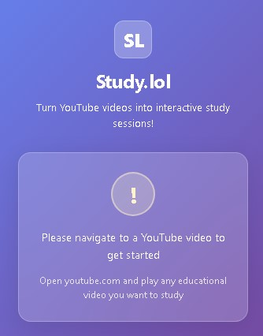
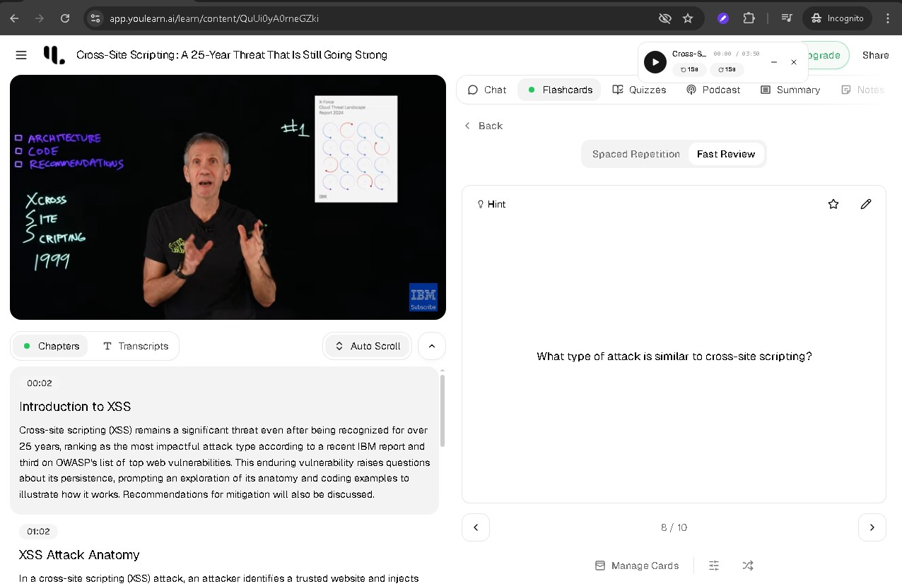

# 📚 **Study.lol -- AI-Powered YouTube Learning Extension**

[]()
[](LICENSE)
[](https://youlearn.ai)
[](https://github.com/Nuknov)
[](https://nuknov.github.io)

**Study.lol** is a lightweight browser extension that transforms any YouTube video into an **interactive AI-powered study session** with one click.

Minimal. Smart. Focused.  
Built for **students, lifelong learners, researchers and educators** who turn videos into knowledge.

---

## 📸 **Screenshots**




---

## 🧩 **What Study.lol Does**

- Converts **YouTube videos** to interactive study sessions
- Works with **regular & embedded** YouTube URLs
- Opens study sessions in a **new tab**
- Features **beautiful glassmorphism UI** with smooth animations
- Provides **instant feedback** and progress indicators
- Runs **entirely in-browser**

Designed for **seamless learning, zero friction**.

> \* *Powered by [YouLearn.ai](https://youlearn.ai) platform for AI-enhanced studying.*

---

## 🛰️ **Tech Stack**

- **Manifest V3** – Latest Chrome Extension API  
- **JavaScript + HTML/CSS** – Clean popup interface  
- **Glassmorphism Design** – Modern UI/UX principles  
- **HCI-Optimized** – User-centered interaction design  

---

## ⚡ **Features**

| Feature                     | Details                                                     |
|----------------------------|-------------------------------------------------------------|
| One-Click Conversion       | Instantly transform YouTube videos to study sessions        |
| Dual URL Support           | Works with youtube.com and youtube-nocookie.com             |
| Beautiful UI               | Glassmorphism design with smooth animations                 |
| Smart Detection            | Auto-detects video IDs from various YouTube URL formats     |
| New Tab Opening            | Opens study sessions without leaving your current video     |
| Error Handling             | Clear feedback when not on a YouTube video                  |
| Lightweight                | Under 50KB, minimal resource usage                          |

---

## 🛠️ Installation

1. **Clone the repository**
   ```bash
   git clone https://github.com/Nuknov/SmartStudy-AI.git
   
   (Or download and extract it)

   cd SmartStudy-AI
   ```

2. **Open your browser extension page**  
   - Chrome: Navigate to `chrome://extensions/`  
   - Edge: Navigate to `edge://extensions/`

3. **Enable Developer Mode**  
   - Toggle the switch in the top-right corner

4. **Load the extension**  
   - Click **"Load unpacked"**  
   - Select the `SmartStudy-AI` directory

5. **Pin the extension (optional)**  
   - Click the puzzle icon in the toolbar  
   - Pin **"Study.lol"**

6. **Start Studying**  
   - Open any YouTube video  
   - Click the Study.lol extension icon  
   - Your study session opens in a new tab!

### Firefox (Temporary Load)
1. Go to `about:debugging#/runtime/this-firefox`  
2. Click **"Load Temporary Add-on"**  
3. Select `manifest.json` from the repo

---

## ⚙️ How It Works

Study.lol uses **intelligent URL parsing** to:
- Detect YouTube video IDs from standard and embedded URLs
- Convert URLs to YouLearn.ai study session format
- Open interactive study sessions in new tabs
- Provide clear visual feedback throughout the process

**Supported URL Formats:**

1. **Regular YouTube:**
   ```
   https://www.youtube.com/watch?v=VIDEO_ID
   ↓
   https://app.youlearn.ai/add/https://www.youtube.com/watch?v=VIDEO_ID
   ```

2. **Embedded YouTube:**
   ```
   https://www.youtube-nocookie.com/embed/VIDEO_ID?playlist=...
   ↓
   https://app.youlearn.ai/add/https://www.youtube.com/watch?v=VIDEO_ID
   ```
Note: To access advanced features like flashcards, quizzes, and podcasts, please sign in at YouLearn.ai

✅ **No data collection.**  
✅ **No background tracking.**  
✅ **Fully open source.**

---

## ⚠️ Disclaimer

> This extension is intended solely for **educational and personal learning purposes**.  
>
> It redirects YouTube URLs to **YouLearn.ai**, a third-party AI learning platform:  
> - YouLearn.ai is **not owned or controlled by the extension author**  
> - The author is **not responsible** for the YouLearn.ai service or its terms  
>
> Always comply with [YouTube's Terms of Service](https://www.youtube.com/t/terms).

---

## 🧠 Use Cases

- Converting educational YouTube videos into interactive study materials  
- Creating AI-powered notes from lecture videos  
- Transforming tutorial videos into searchable knowledge bases  
- Building custom study sessions from conference talks  
- Enhancing online learning with AI assistance  

Ideal for **active learners** who want to engage deeply with video content.

---

## **Author**

**Created by:** Nuknov
